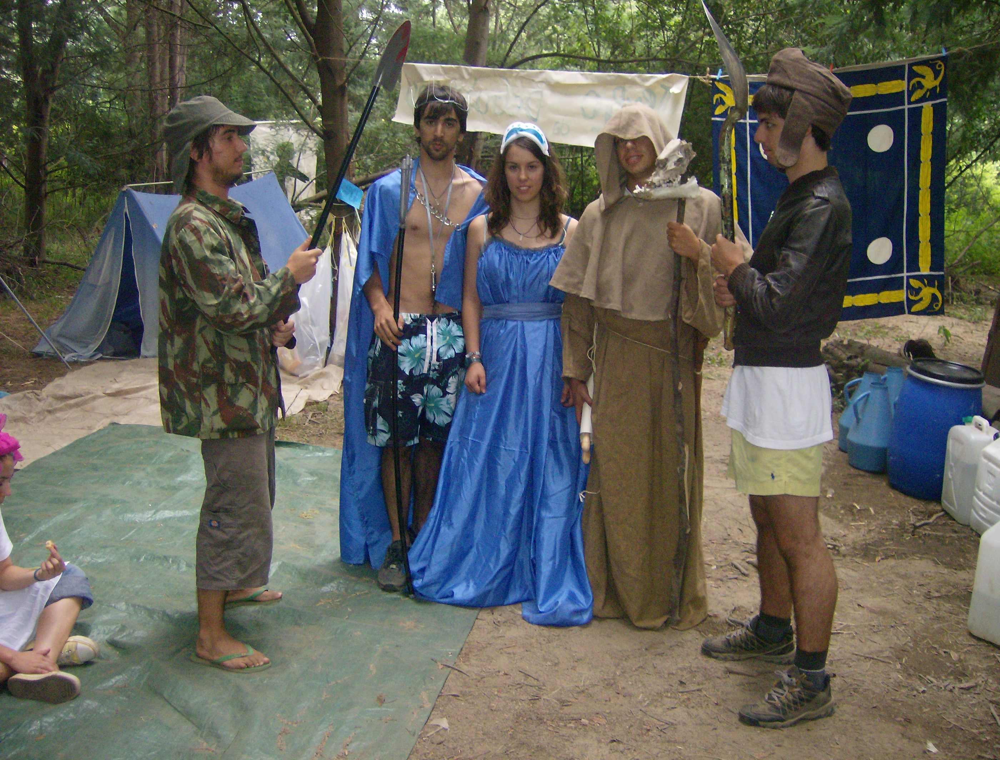

# OPA

O OPA foi um acampamento de [Trotinetas](../../Categorias/Trotinetas.md) que decorreu entre 5 e 14 de Agosto em [Serpins](../../Restrito/Locais%20de%20Acampamento/Ribeira%20do%20Conde%20%28Serpins%29.md).

## Animadores

- [Director](../../Cargos/Director.md) - [Pedro Vicente](../../Pessoas/P/Pedro%20Vicente.md)
- [Mamã](../../Cargos/Mam%C3%A3.md) - [Maria Ferreira](../../Pessoas/M/Maria%20Cort%C3%AAs%20Ferreira.md)
- [Director-Adjunto](../../Cargos/Director-Adjunto.md) - [Bernardo Narciso](../../Pessoas/B/Bernardo%20Narciso.md)
- [Capelão](../../Cargos/Capel%C3%A3o.md) - [Sérgio Carvalho](../../Pessoas/S/S%C3%A9rgio%20Carvalho.md) sj e Manuel Cardoso sj
- [Tios](../../Cargos/Tio.md) - [Ana Simões](../../Pessoas/A/Ana%20Sim%C3%B5es.md) e [Ana Quaresma](../../Pessoas/A/Ana%20Quaresma.md)
- [Animadores Livres](../../Cargos/Animador%20Livre.md) - [Goga](../../Pessoas/D/Diogo%20Cordeiro%20Ferreira.md), [Gonçalo Vaz Pedro](../../Pessoas/G/Gon%C3%A7alo%20Vaz%20Pedro.md), [Martinho Lucas Pires](../../Pessoas/M/Martinho%20Lucas%20Pires.md) e [Majo](../../Pessoas/M/Maria%20Jo%C3%A3o%20Sim%C3%B5es.md)
- [Animadores de Equipa](../../Cargos/Animador%20de%20Equipa.md) - [Mário Carvalho](../../Pessoas/M/M%C3%A1rio%20Carvalho.md), [Rita Lourenço](../../Pessoas/R/Rita%20Louren%C3%A7o.md), [Elias Oliveira](../../Pessoas/E/Elias%20Oliveira.md), [Mariana Franco](../../Pessoas/M/Mariana%20Franco.md), [Beatriz Miranda](../../Pessoas/B/Beatriz%20Miranda.md), [Silvinha](../../Pessoas/S/S%C3%ADlvia%20Reis.md) e [Caramela](../../Pessoas/J/Joana%20Martins.md)

## Imaginarium

Era uma vez... a Atlântida, uma cidade avançada, que tinha o seu Rei, Rainha, Chefe da Guarda Real e respectiva guarda real, Princesa Safira e Jade, Mago, Sábios e seus Aprendizes.

Como uma civilização avançada, a Atlântida tinha uma tradição de passagem que envolvia conhecer outras civilizações, pessoas e tradições para que se pudesse crescer vendo pessoas/culturas variadas.

Para isso, era preciso que a própria pessoa já se conhecesse bem suficiente, para estar aberta a elas... os Magos, tinham a capacidade de conseguir ajuda-las a fazer isso.

Assim sendo, a cada 100 anos, o Rei mandava emergir a Atlântida para que os Aprendizes dos 7 Sábios se espalhassem pelo mundo para começarem a sua passagem, no entanto, isso só acontecia quando todos os Sábios informavam o Rei que os seus aprendizes estavam preparados, e ele achava que era a altura certa.

Era sempre uma surpresa, ninguém sabia bem quando o Rei o ia fazer, o que fazia com que todos os dias eles estivessem preparados a partir...

Durante o tempo em que esperavam aumentavam o conhecimento de si mesmos e do restante grupo que estava prestes a partir.

(...)

"É hoje" - diz o Rei, enquanto a Atlântida emerge do fundo das águas. (Dia da caminhada)

A jornada começou, eles estão prontos para começar a viagem, e o Rei anuncia que segundo a tradição, irá com a restante corte e Magos junto com os Sábios e Aprendizes, acompanhando-os nessa viagem.

(...)

A viagem começa... até que chegamos a:

- Tibete
[Simplicidade]

- Brasil
[Talentos e Alegria]

- África
[Serviço e Ajuda]

- Itália
[Fé e Festa]

(...)

Estava na altura dos aprendizes regressarem a Atlântida... já tinham crescido, e aprendido imensas coisas através das quais a Atlântida podia crescer e melhorar ainda mais...

No entanto, esse crescimento levou todos a ver que seriam mais úteis não na Atlântida mas no mundo, para que ajudassem o mundo a crescer também...

O rei, que pensariam que iria recusar a decisão deles diz:

"Parabéns! Agora são de facto sábios, o mundo espera-vos!"

Voltam para o mundo, ousando tentar fazer a diferença!

## Hino

O dia acordou cinzento

Triste como tudo

Desafiaste o vento

E foste mudar o mundo

Uuuuuuoooooooooo

REFRÃO:

Onde pára a Atlântida?

Para fora tens de ir,

Onde pára a Atlântida?

Vamos lá descobrir...

Bravo jovem Atlânte

Que da água emergiste

Dá-te aos outros, sê marcante

Prova que Deus existe!

Uuuuuuoooooooooo

REFRÃO

OPA!!!! PARA FORA AQUI E AGORA!!!!

REFRÃO

## Amigo Secreto

Secreto,

Um amigo especial,

Secreto,

Estejas bem ou estejas mal,

Secreto,

Uma pessoa brutal,

Secreto,

Alguém monumental,

Secreto,

Segue-me e vem comigo,
eu sou o teu amigo,

SECRETO! AMIGO! SECRETO! AMIGO!

## Blog

http://OPA07.blogspot.com *OPA 07*

## Páginas que ligam para aqui

- [Ana Quaresma](../../Pessoas/A/Ana%20Quaresma.md)
- [Ana Simões](../../Pessoas/A/Ana%20Sim%C3%B5es.md)
- [Beatriz Miranda](../../Pessoas/B/Beatriz%20Miranda.md)
- [Bernardo Narciso](../../Pessoas/B/Bernardo%20Narciso.md)
- [Diogo Cordeiro Ferreira](../../Pessoas/D/Diogo%20Cordeiro%20Ferreira.md)
- [Elias Oliveira](../../Pessoas/E/Elias%20Oliveira.md)
- [Gonçalo Vaz Pedro](../../Pessoas/G/Gon%C3%A7alo%20Vaz%20Pedro.md)
- [Joana Martins](../../Pessoas/J/Joana%20Martins.md)
- [Maria Cortês Ferreira](../../Pessoas/M/Maria%20Cort%C3%AAs%20Ferreira.md)
- [Maria João Simões](../../Pessoas/M/Maria%20Jo%C3%A3o%20Sim%C3%B5es.md)
- [Mariana Franco](../../Pessoas/M/Mariana%20Franco.md)
- [Martinho Lucas Pires](../../Pessoas/M/Martinho%20Lucas%20Pires.md)
- [Mário Carvalho](../../Pessoas/M/M%C3%A1rio%20Carvalho.md)
- [Pedro Vicente](../../Pessoas/P/Pedro%20Vicente.md)
- [Rita Lourenço](../../Pessoas/R/Rita%20Louren%C3%A7o.md)
- [Sérgio Carvalho](../../Pessoas/S/S%C3%A9rgio%20Carvalho.md)
- [Sílvia Reis](../../Pessoas/S/S%C3%ADlvia%20Reis.md)

---

| Categorias |
| --- |
| [Acampamentos](../../Categorias/Acampamentos.md) |
| [Acampamentos de 2007](../../Categorias/Acampamentos%20de%202007.md) |
| [Trotinetas](../../Categorias/Trotinetas.md) |
