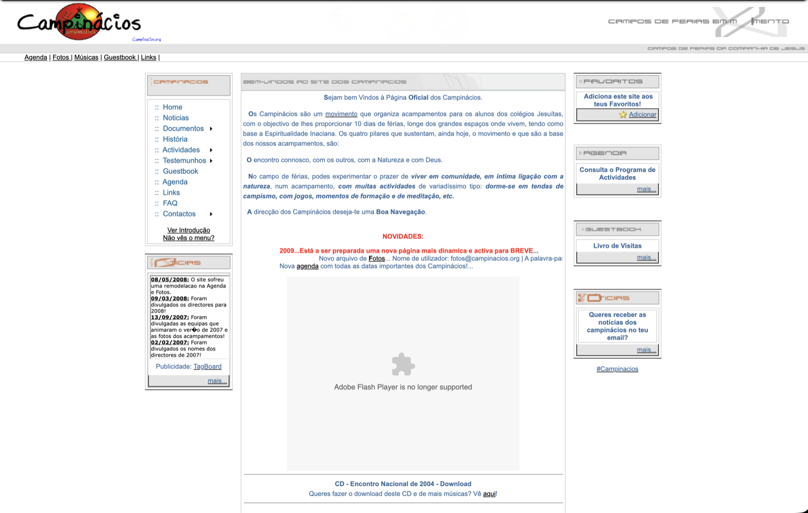

# Online

Os sítios e as redes onde os Campinácios estão, ou estiveram, na Internet.

## Hoje

- [Página oficial](https://www.campinacios.pt)
- [YouTube](https://www.youtube.com/@campinacios)
- [Instagram](https://www.instagram.com/campinacios/)
- [Facebook](https://www.facebook.com/campinacios/?locale=pt_PT)
- [Notícias](Not%C3%ADcias.md) publicadas sobre os Campinácios

## A página original {#pagina-original}

A primeira página dos Campinácios na Internet, «Campos de Férias em Movimento — Campos de Férias da Companhia de Jesus», foi criada pelo [Paulo Correia](../Pessoas/P/Paulo%20Correia.md). Ficou depois a geri-la o [Diogo Costa](../Pessoas/D/Diogo%20Costa.md), que mais tarde a passou ao [Pedro Vicente](../Pessoas/P/Pedro%20Vicente.md) e ao [Filipe Próspero](../Pessoas/F/Filipe%20Pr%C3%B3spero.md).

Na página principal lia-se:

> Sejam bem Vindos à Página **Oficial** dos Campinácios.
>
> Os Campinácios são um movimento que organiza acampamentos para os alunos dos colégios Jesuítas, com o objectivo de lhes proporcionar 10 dias de férias, longe dos grandes espaços onde vivem, tendo como base a Espiritualidade Inaciana. Os quatro pilares que sustentam, ainda hoje, o movimento e que são a base dos nossos acampamentos, são:
>
> O encontro connosco, com os outros, com a Natureza e com Deus.
>
> No campo de férias, podes experimentar o prazer de ***viver em comunidade, em íntima ligação com a natureza***, num acampamento, ***com muitas actividades*** de variadíssimo tipo: ***dorme-se em tendas de campismo, com jogos, momentos de formação e de meditação, etc.***
>
> A direcção dos Campinácios deseja-te uma **Boa Navegação**.

Outra cópia, guardada pelo Arquivo.pt a 24 de Setembro de 2009 no endereço campinacios.loyola.pt: [ver no Arquivo.pt](https://arquivo.pt/wayback/20090924173834/http://campinacios.loyola.pt/home.html).

Tinha secções de Notícias, Documentos, História, Actividades, Testemunhos, Livro de Visitas (*Guestbook*), Agenda, Fotos, Músicas, Links, FAQ e Contactos, uma *newsletter* por email e um canal de IRC, #Campinacios. Entre as últimas notícias estavam a divulgação dos directores de 2007 e de 2008 e das equipas e fotos dos acampamentos do Verão de 2007, e ainda o CD do Encontro Nacional 2004, que se podia descarregar. Em 2009 anunciava-se «uma nova página mais dinâmica e activa para breve»: foi a [Revolução Campinácios v2.0](Revolu%C3%A7%C3%A3o%20Campin%C3%A1cios%20v2.0.md).

## A página da Revolução Campinácios v2.0 {#pagina-v2}

Em 2009 a página original deu lugar à página da [Revolução Campinácios v2.0](Revolu%C3%A7%C3%A3o%20Campin%C3%A1cios%20v2.0.md), em Campinacios.org, que trouxe também o Wikinácios. Fica aqui, como registo histórico, uma reconstrução da sua página principal tal como estava a 30 de Maio de 2012; as imagens que não ficaram guardadas aparecem como espaços vazios.

## O Wikinácios em 2013 {#wikinacios-2013}

A Wikinácios foi um dos sítios que a Revolução Campinácios v2.0 trouxe, feito pelo [Pedro Vicente](../Pessoas/P/Pedro%20Vicente.md) e pelo [Filipe Barroso](../Pessoas/F/Filipe%20Barroso.md) com ajuda do António Queirós Martins, [Sílvia Lobo](../Pessoas/S/S%C3%ADlvia%20Lobo.md) e [Tiago Bahia](../Pessoas/T/Tiago%20Bahia.md). Fica aqui, como registo histórico, a sua página principal tal como estava a 1 de Outubro de 2013, com 880 artigos.

Na página principal lia-se, nos «Eventos recentes»:

> **6 de Janeiro de 2009** — Página dos Campinácios muda-se para um novo servidor, iniciando-se a Revolução Campinácios v2.0!
>
> **31 de Janeiro de 2009** — Bate-se a margem dos 300 artigos publicados com a Wiki ainda não divulgada oficialmente.
>
> **25 de Novembro de 2009** — É oficialmente divulgada a Wikinácios com 630 artigos, sendo a primeira das grandes mudanças da Revolução a ser divulgada!

---

| Categorias |
| --- |
| [História](../Categorias/Hist%C3%B3ria.md) |
